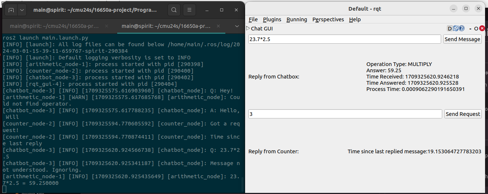

# MRSD Programming Familiarization, Pt. 2



## Dependencies

- [ROS2 Humble](https://docs.ros.org/en/humble/Installation/Ubuntu-Install-Debians.html) (likely works OK with other versions)

  - No ROS2? For the lazy, try `$ docker run -it -v $(pwd):/ws ros:foxy /bin/bash`

- Various ROS2 packages. From the repo root, try running:

```bash
$ rosdep update
$ rosdep install -i --from-paths src
```

## Building and running

```bash
$ . /opt/ros/humble/setup.bash # source ROS if you haven't done so
$ colcon build
$ . install/setup.bash # must be done in every new terminal session
$ ros2 launch main.launch.py
```
